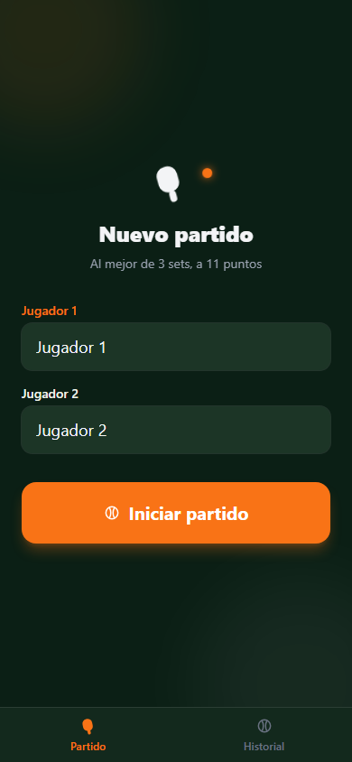
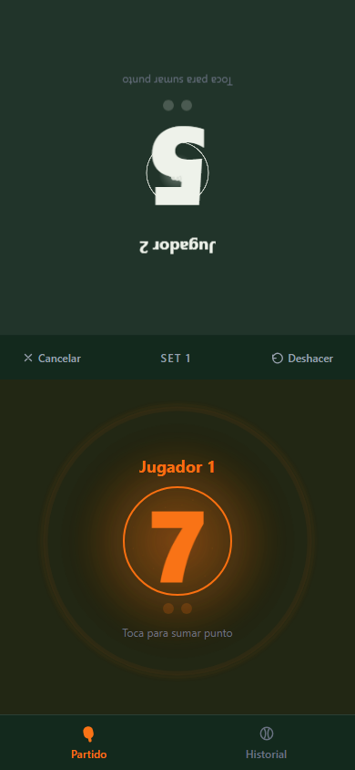
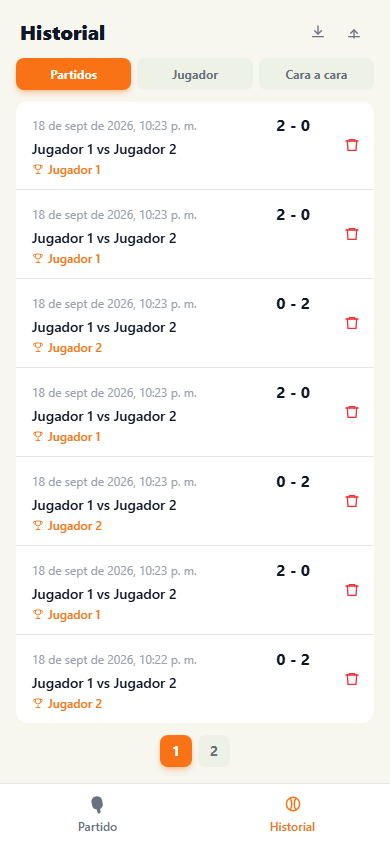
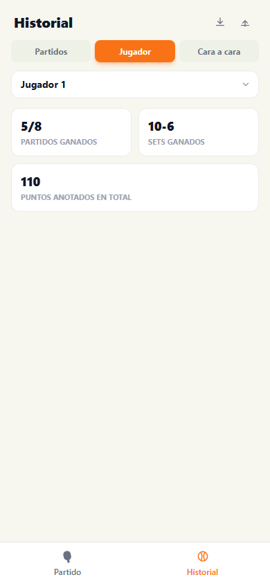
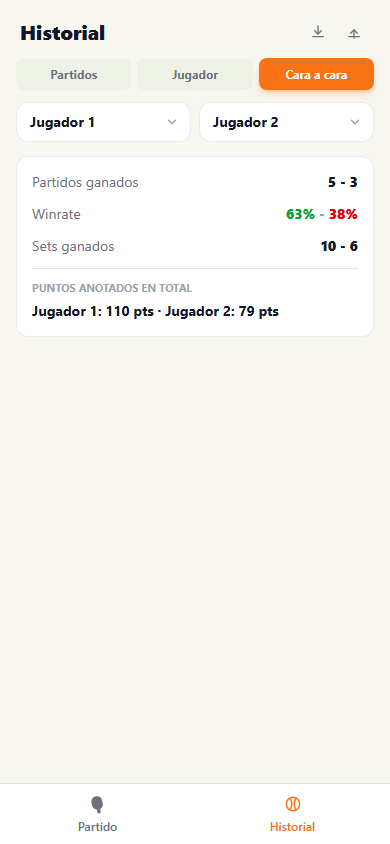
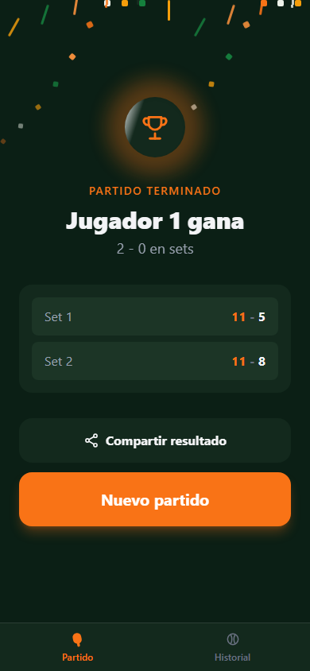

# Ping Pong Tracker

PWA para llevar el conteo en vivo de partidos de ping pong al mejor de 3 sets (Bo3), con historial guardado localmente en el dispositivo (IndexedDB) — sin backend, sin login, funciona sin conexión.

## Stack

| Capa | Tecnología |
|---|---|
| UI | React 19 + Vite |
| Estilos | Tailwind CSS 4 |
| Persistencia local | Dexie.js sobre IndexedDB |
| PWA / offline | vite-plugin-pwa (service worker + manifest) |
| Empaquetado nativo | Capacitor (proyecto Android para generar APK) |
| Lint | oxlint |
| Capturas de pantalla | Playwright |

## Funcionalidades

### Nuevo partido

Pantalla de inicio donde se editan los nombres de ambos jugadores antes de arrancar. Un partido es al mejor de 3 sets, cada set a 11 puntos con diferencia mínima de 2.



### Marcador en vivo

Marcador grande y táctil (tap para sumar punto), pensado para usarse con el celular en la mano mientras se juega. Detecta automáticamente el fin de set y de partido, con animaciones de feedback al anotar y al cerrar un set.



### Historial — Partidos

Lista de partidos jugados, con filtro por jugador y por rango de fechas (combinables entre sí). Cada partido se puede abrir para ver el detalle set por set, editar los nombres o borrarlo.



### Historial — Jugador

Totales individuales de un jugador: partidos ganados, sets ganados y puntos anotados en total, eligiéndolo desde un selector.



### Historial — Cara a cara

Comparación directa entre dos jugadores: partidos ganados por cada uno, sets ganados por cada uno, y el total de puntos anotados por cada uno en todos los sets que han jugado entre sí.



### Compartir resultado

Al terminar un partido (o desde el detalle de uno ya guardado) se puede compartir el resultado como texto plano, usando el selector nativo del celular (Web Share API) o copiándolo al portapapeles si no está disponible.



### Otros detalles

- **Modo dual de tema**: el marcador en vivo usa un tema oscuro de alto contraste (para jugar de noche sin encandilarse), mientras que el Historial usa un tema claro y más denso, pensado para consultarse con calma.
- **Estados vacíos consistentes**: un mismo componente (`EmptyState`) se usa en las tres pestañas del Historial cuando todavía no hay datos que mostrar.
- **Exportar / importar historial** como JSON desde la pestaña Partidos.
- **Deshacer último punto**, con confirmación si eso reabre un set ya cerrado.

## Estructura de carpetas

```
src/
├── components/       # Componentes de UI (uno por archivo)
│   ├── icons.jsx      # Iconografía SVG compartida
│   ├── MatchSetup.jsx        # Nuevo partido
│   ├── MatchScreen.jsx       # Orquesta setup / marcador / resultado
│   ├── ScoreBoard.jsx        # Marcador en vivo
│   ├── MatchResult.jsx       # Resumen de partido terminado
│   ├── ConfirmDialog.jsx     # Diálogo de confirmación reutilizable
│   ├── EmptyState.jsx        # Estado vacío reutilizable
│   ├── HistoryScreen.jsx     # Historial: pestañas y lista de Partidos
│   ├── PlayerStatsTab.jsx    # Historial: pestaña Jugador
│   ├── HeadToHeadTab.jsx     # Historial: pestaña Cara a cara
│   └── MatchDetail.jsx       # Detalle de un partido guardado
├── hooks/
│   ├── useLiveMatch.js       # Estado y reglas del partido en curso
│   └── useInstallPrompt.js   # Prompt de instalación como PWA
├── utils/
│   ├── gameLogic.js          # Reglas de sets/partido (Bo3, a 11, ventaja 2)
│   ├── matchStats.js         # Totales por jugador y cara a cara
│   ├── shareMatch.js         # Texto y lógica para compartir un resultado
│   └── haptics.js            # Vibración en puntos/sets/partido
├── db.js              # Persistencia en IndexedDB (Dexie)
├── App.jsx            # Layout general y navegación por pestañas
└── main.jsx           # Punto de entrada
scripts/
├── gen-icons.mjs              # Genera los íconos de la PWA
└── capture-screenshots.mjs    # Genera las capturas de docs/screenshots
docs/
└── screenshots/       # Capturas usadas en este README
android/               # Proyecto nativo generado por Capacitor
```

## Desarrollo local

```bash
npm install
npm run dev
```

Abre la URL que muestra la terminal (por defecto `http://localhost:5173`).

## Build de producción

```bash
npm run build
npm run preview
```

## Generar las capturas de pantalla

Con la app corriendo en local (`npm run dev`), en otra terminal:

```bash
node scripts/capture-screenshots.mjs
```

Juega un partido de prueba con nombres ficticios a través de la propia UI y regenera las imágenes en `docs/screenshots/`.

## Instalar en Android

Hay dos formas de tener la app en el celular: como PWA instalada desde el navegador, o como APK nativo compilado con Capacitor.

### Opción A — PWA desde el navegador

Requiere que la app esté servida por HTTPS (los service workers no funcionan por HTTP en un celular, `localhost` en tu PC no cuenta).

1. Despliega `dist/` en un hosting estático (Vercel, Netlify, GitHub Pages, etc.).
2. Abre la URL en Chrome desde el celular.
3. Toca el menú (⋮) y selecciona **"Agregar a pantalla de inicio"** / **"Instalar app"** (o usa el banner "Instalar app" que muestra la propia app cuando detecta que se puede instalar).
4. Confirma. Queda instalada como una app normal, con ícono propio y funcionando offline.

### Opción B — APK nativo con Capacitor (sin necesidad de hosting)

El proyecto Android ya está generado en `android/`. Requiere **Android Studio** con el SDK de Android y un JDK compatible con Gradle/AGP (el JDK que trae incluido el propio Android Studio funciona; configúralo en *Build, Execution, Deployment → Build Tools → Gradle → Gradle JDK*).

1. Genera el build web y sincronízalo con el proyecto nativo:
   ```bash
   npm run build
   npx cap sync android
   ```
2. Abre el proyecto en Android Studio:
   ```bash
   npx cap open android
   ```
3. Espera a que sincronice Gradle. Compila el APK con **Build → Build Bundle(s) / APK(s) → Build APK(s)**, o conecta el celular por USB (con "Depuración USB" activada) y dale al botón ▶ para instalarlo y abrirlo directo.
4. Si compilaste el APK sin conectar el celular, el archivo queda en `android/app/build/outputs/apk/debug/app-debug.apk` — pásalo al teléfono (cable, Drive, etc.), ábrelo desde el explorador de archivos y permite "instalar apps desconocidas" cuando lo pida.

Nota: si el proyecto vive en una carpeta con tildes/ñ u otro caracter no-ASCII en la ruta (como pasa aquí con "AplicaciónPingPong"), `android/gradle.properties` ya tiene `android.overridePathCheck=true` para evitar que Gradle falle por eso.
